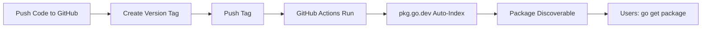

# Summary of Changes - Go Package Publication Setup

## Overview

This document summarizes all changes made to prepare your Go dependency injection library for publication and discovery in the Go ecosystem.

## Critical Fixes

### 1. Module Path Consistency ✅

**Problem**: Mismatched module paths between `go.mod`, imports, and documentation.

**Solution**: Updated all references to use the correct GitHub path:
- `go.mod`: `module github.com/pegasusheavy/go-dependency-injector`
- All imports updated across:
  - `main.go`
  - `di/benchmark_test.go`
  - `di/container_test.go`
  - `README.md` examples

### 2. Documentation Updates ✅

**Added to README.md**:
- Professional badges (Go Reference, Go Report Card, License, Go Version)
- Correct installation instructions
- Package discovery section
- Publishing guide for maintainers
- FAQ section
- Related projects comparison

## New Files Created

### Documentation
1. **CHANGELOG.md** - Version history tracking
2. **CONTRIBUTING.md** - Contribution guidelines for community
3. **SECURITY.md** - Security policy and vulnerability reporting
4. **SETUP_GUIDE.md** - Step-by-step publication guide
5. **SUMMARY.md** - This file
6. **docs/PUBLISHING.md** - Comprehensive publishing documentation

### GitHub Configuration
7. **.github/workflows/ci.yml** - Continuous Integration
   - Tests on multiple Go versions (1.22, 1.23)
   - Code coverage reporting
   - Linting with golangci-lint
   - Benchmark execution

8. **.github/workflows/release.yml** - Automated Releases
   - Triggers on version tags
   - Creates GitHub releases
   - Triggers pkg.go.dev indexing

9. **.github/PULL_REQUEST_TEMPLATE.md** - PR template

10. **.github/ISSUE_TEMPLATE/bug_report.md** - Bug report template

11. **.github/ISSUE_TEMPLATE/feature_request.md** - Feature request template

### Project Configuration
12. **.golangci.yml** - Linter configuration
13. **.gitignore** - Git ignore patterns

## Verification

### Tests Status
```
✅ All tests passing (49/49)
✅ Build successful
✅ No import errors
✅ go mod tidy successful
```

### Package Structure
```
go-dependency-injector/
├── .github/
│   ├── workflows/
│   │   ├── ci.yml          # CI pipeline
│   │   └── release.yml     # Release automation
│   ├── ISSUE_TEMPLATE/
│   │   ├── bug_report.md
│   │   └── feature_request.md
│   └── PULL_REQUEST_TEMPLATE.md
├── di/                     # Core package
│   ├── container.go
│   ├── doc.go
│   ├── errors.go
│   ├── lifetime.go
│   ├── registration.go
│   ├── container_test.go   # ✅ Fixed imports
│   └── benchmark_test.go   # ✅ Fixed imports
├── docs/
│   └── PUBLISHING.md
├── .gitignore
├── .golangci.yml
├── CHANGELOG.md
├── CONTRIBUTING.md
├── go.mod                  # ✅ Fixed module path
├── LICENSE
├── main.go                 # ✅ Fixed imports
├── README.md               # ✅ Enhanced with badges
├── SECURITY.md
├── SETUP_GUIDE.md
└── SUMMARY.md
```

## How Go Package Discovery Works

Unlike npm, PyPI, or Maven, Go uses a decentralized approach:

1. **No Central Registry**: Packages are hosted on version control (GitHub, GitLab, etc.)
2. **Direct Imports**: Users import directly from repository URLs
3. **Automatic Indexing**: pkg.go.dev automatically indexes public Go modules
4. **Version Tags**: Semantic versioning via Git tags (v1.0.0, v1.1.0, etc.)

## Publication Workflow



## Next Steps for Publication

### Immediate (Required)
1. **Push to GitHub**: Ensure code is at `github.com/pegasusheavy/go-dependency-injector`
2. **Create Tag**: `git tag v1.0.0 && git push origin v1.0.0`
3. **Wait**: 5-15 minutes for pkg.go.dev to index
4. **Verify**: Check https://pkg.go.dev/github.com/pegasusheavy/go-dependency-injector

### Optional (Recommended)
1. **Add GitHub Topics**: `go`, `golang`, `dependency-injection`, `di-container`
2. **Submit to Awesome Go**: https://github.com/avelino/awesome-go
3. **Write Announcement**: Blog post, Reddit r/golang, social media
4. **Monitor Issues**: Respond to community feedback

## Benefits of These Changes

### For Discoverability
- ✅ Automatic indexing on pkg.go.dev
- ✅ Professional presentation with badges
- ✅ Clear documentation for users
- ✅ SEO-friendly README

### For Contributors
- ✅ Clear contribution guidelines
- ✅ Issue and PR templates
- ✅ Automated CI/CD
- ✅ Code quality checks

### For Maintainers
- ✅ Automated testing on every PR
- ✅ Automated releases on tag push
- ✅ Consistent versioning
- ✅ Documentation for publishing process

## Key Insights

### Module Path = Repository URL
The module path in `go.mod` MUST exactly match the GitHub repository URL:
```
github.com/pegasusheavy/go-dependency-injector
```

### Semantic Versioning
Go modules use semantic versioning with `v` prefix:
- Patch: v1.0.1 (bug fixes)
- Minor: v1.1.0 (new features, backward compatible)
- Major: v2.0.0 (breaking changes)

### Automatic Everything
Once configured:
- Tags trigger releases automatically
- Tests run on every PR
- pkg.go.dev indexes new versions automatically
- Users get updates with `go get -u`

## Testing Commands

```bash
# Run all tests
go test ./...

# Run with race detection
go test -race ./...

# Run with coverage
go test -coverprofile=coverage.out ./...

# Run benchmarks
go test -bench=. -benchmem ./...

# Build
go build -v ./...

# Lint (requires golangci-lint)
golangci-lint run
```

## Support Resources

- **Documentation**: See SETUP_GUIDE.md for detailed steps
- **Publishing**: See docs/PUBLISHING.md for full process
- **Contributing**: See CONTRIBUTING.md for guidelines
- **Security**: See SECURITY.md for reporting vulnerabilities

## Conclusion

Your Go package is now fully configured and ready for publication. The module path is consistent across all files, documentation is comprehensive, and automation is in place for CI/CD.

**To publish**: Simply push your code to GitHub and create a version tag.

**Result**: Your package will be discoverable and installable by the global Go community within minutes.

---

**Package URL**: https://github.com/pegasusheavy/go-dependency-injector
**Installation**: `go get github.com/pegasusheavy/go-dependency-injector`
**Documentation**: https://pkg.go.dev/github.com/pegasusheavy/go-dependency-injector

Good luck! 🚀


